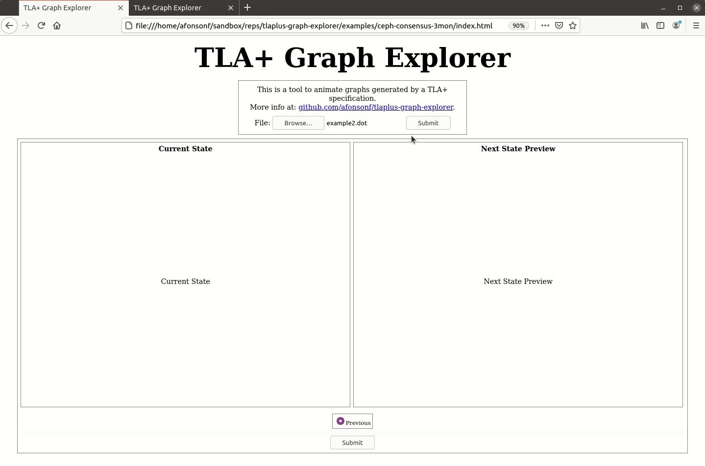

# TLA+ Graph Explorer
This is a static web application to explore and animate a TLA+ state graph.

The application works by parsing a dot file generated by a TLA+ specification and then having visual representations to more easily understand and go through the reachable states.

The application is written to support big dot files and not load the whole file into memory. This is achieved by reading the file in chunks and storing only the location of the node in the file. The structure to save the nodes location, in my experiments, takes around 1/10th of the dot file size.

## Examples

#### Example 1 - Missionaries and Cannibals
Spec: [https://github.com/tlaplus/Examples/tree/master/specifications/MissionariesAndCannibals](https://github.com/tlaplus/Examples/tree/master/specifications/MissionariesAndCannibals).

#### Example 2 - Ceph consensus algorithm
Spec: [https://github.com/afonsonf/ceph-consensus-spec](https://github.com/afonsonf/ceph-consensus-spec).

## How to use

The application is in the folder [src](src).

The default way to represent a state is showing the pretty printed version, as shown previously in example 1.

The representation of a state can be personalized by changing the function drawState in the file [tla-state.js](src/tla-state.js). An example of a personalized state representation is shown in the example 2 and the source code is in [examples/ceph-consensus-3mon](examples/ceph-consensus-3mon).

To help create a personalized representation of a state, the application comes with a parser that parses a tla+ state into JavaScript structures. The parser definition is in folder [expr-parser](expr-parser) and example usage of the parser (function parseVars) can be found at [examples/ceph-consensus-3mon](examples/ceph-consensus-3mon).

## Related tools

The ideas behind this tool were inspired by [TLA+ Animation Module](https://github.com/will62794/tlaplus_animation) and [Runway](https://github.com/salesforce/runway-browser).
