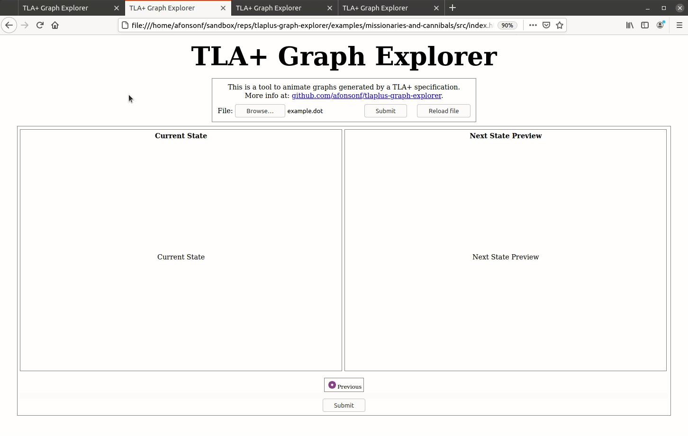
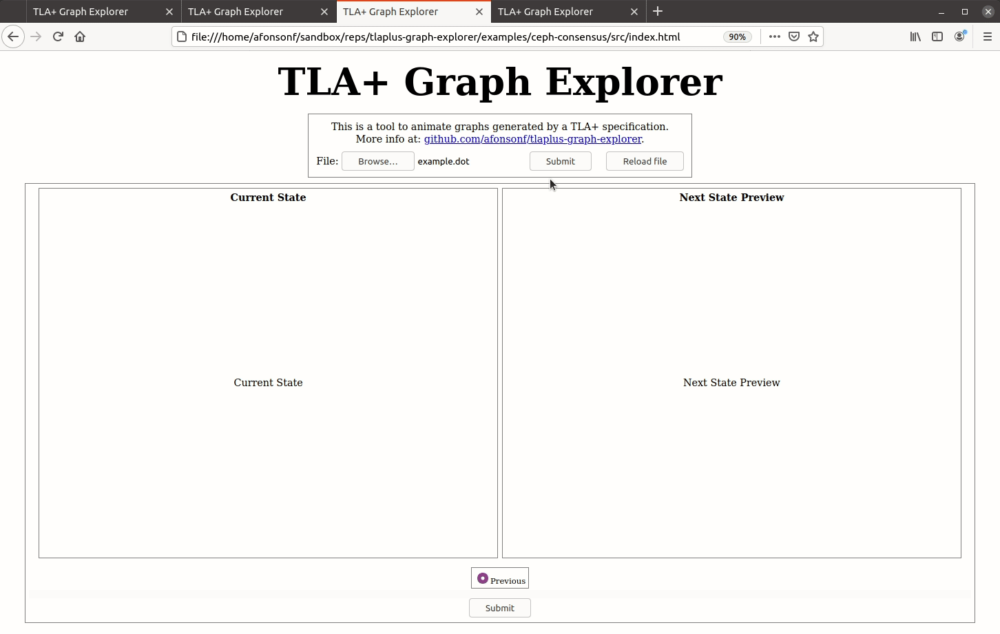
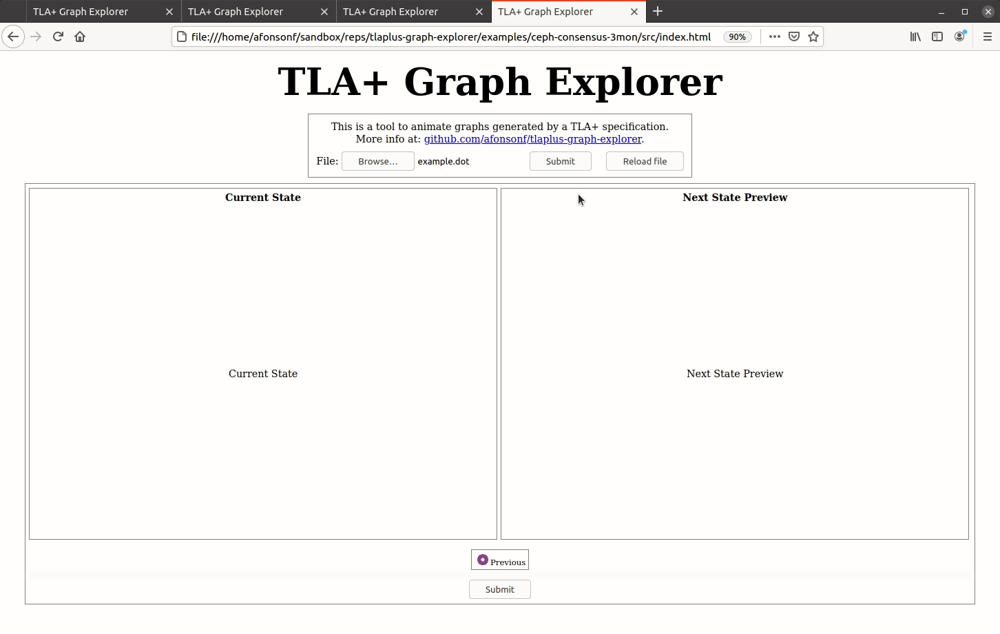

# Examples

In each folder there is the source code for the personalized state and the example dot file used. In the default folder there is no source code because it uses the default configuration found in [../src](../src).

#### Example 1 - Missionaries And Cannibals (Default Configuration)
Spec: [https://github.com/tlaplus/Examples/tree/master/specifications/MissionariesAndCannibals](https://github.com/tlaplus/Examples/tree/master/specifications/MissionariesAndCannibals).

#### Example 2 - Missionaries And Cannibals (Personalized)
Spec: [https://github.com/tlaplus/Examples/tree/master/specifications/MissionariesAndCannibals](https://github.com/tlaplus/Examples/tree/master/specifications/MissionariesAndCannibals).

#### Example 3 - Ceph Consensus Algorithm (Personalized)

Spec: [https://github.com/afonsonf/ceph-consensus-spec](https://github.com/afonsonf/ceph-consensus-spec).

#### Example 4 - Old Ceph Consensus Algorithm (Personalized with svg.js)

Spec: [https://github.com/afonsonf/ceph-consensus-spec](https://github.com/afonsonf/ceph-consensus-spec).

